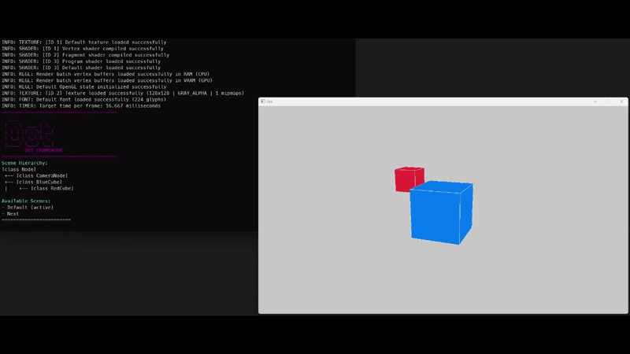

Dot was a project I started to get more familiar with C++. It is a small framework built on top of Raylib, inspired by node-based engines like Godot. 

Its features include:
- A node-based hierarchy
- Input abstraction
- Unity-style Coroutines
- Camera detection
- Scene management
- A command-line debug overlay that displays the contents of the current scene

You can get started by registering at least one initial scene and running Dot via DotApp.Run within main().

```
#include "dot.h"
#include "scenes/default_scene.h"

int main()
{
    new DefaultScene(); // Registers itself
    SceneManager::Get().ChangeSceneByName("Default");

    DotApp app;
    app.Run(1280, 720, "My Game");
}
```


